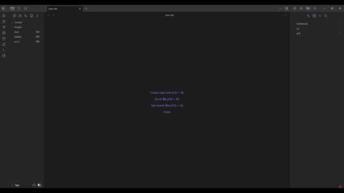

# Obsidian Uni Notes Plugin

**Uni Notes** allows users to extract images and text from a `.pdf` file and link them together in a `.md` file. Users can customise tags, select output directories, and set default behaviour in the settings.

Supported input file types:
- `.pdf`

Supported output file types:
-  `.png`

### Installation
Uni Notes is not yet available from Obsidian Community Plugins, so there is one method to download it:
1. Inside your vault, go to `.obsidian` folder
2. Create a folder names `uni-notes`
3. Download the `main.js`, `manifest.json` and `pdf.worker.js` into the `uni-notes` folder
4. Activate the plugin in your settings like any other settings.

Please feel free to leave feedback and bug reports! :)

##  ⚠️ WORK IN PROGRESS ⚠️
-  This plugin is  **desktop only**
- The [Text Extractor](https://github.com/scambier/obsidian-text-extractor) plugin must be installed and enabled for Uni Notes to work. Text Extractor requires an internet connection, so OCR will not work offline in Uni Notes.
- Support for further file types is in progress.

